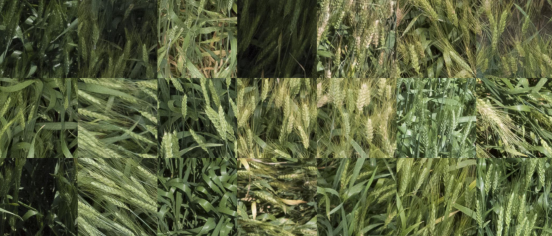

# A Binary Classification Model to Predict Wheat Phenotype (Awned vs. Awnless)

There is a field in Kansas, with some wheat (Triticum sp.). A drone flew over the field and took pictures.
Those pictures are our dataset. One of the primary characteristics we care about is the presence of awns, a hair-like structure on the mature (or maturing) head (top) of the wheat plant. The data looks mostly like this:   

